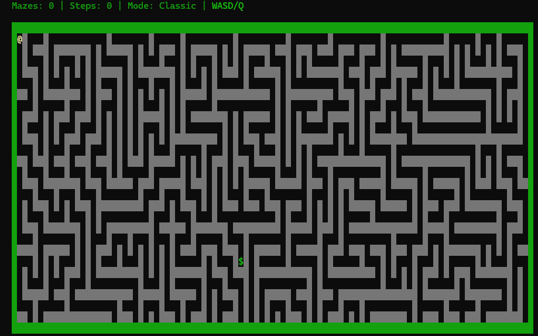
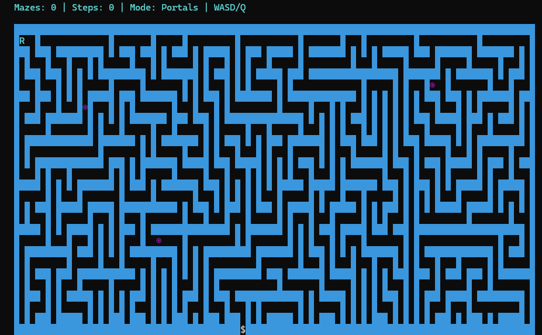
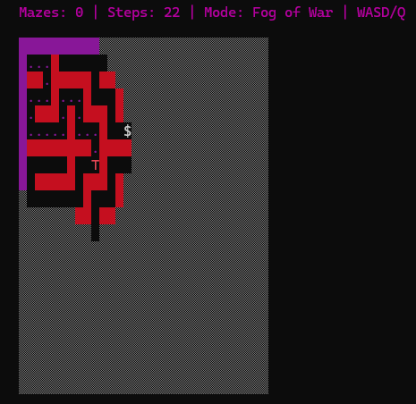
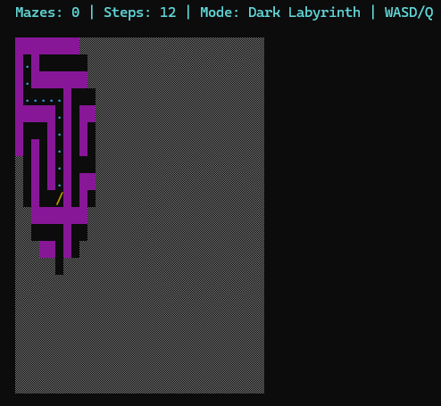

<div align="center">

# TTY MAZE

### A terminal-based maze game written in C


[Features](#-features) • [Installation](#-installation) • [How to Play](#-how-to-play) • [Contributing](#-contributing)

---

</div>

##  Features

<table>
<tr>
<td width="50%">

###  Game Modes
- **Classic Mode** - Traditional maze with multiple paths and loops
- **Portal Mode** - Teleport through magical portals scattered across the maze
- **Fog of War** - Limited visibility, explore carefully
- **Dark Labyrinth** - Goal only appears when you get close
- **No Return** - Path becomes wall behind you - no going back!
- **Mirror Mode** - Inverted controls (W→S, A→D)
- **Custom Mode** - Mix and match any combination of modifiers

</td>
<td width="50%">

###  Customization
- **12 Color Presets** for visual variety
- **Custom Color Schemes** with RGB hex color support
- **Custom Player Icon** - Choose any ASCII character
- **Custom Maze Sizes** - Create mazes from 11×11 up to 99×49

###  Other Features
- **Leaderboard System** - Top 10 high scores saved locally
- **Multiple Difficulty Levels** - Easy, Medium, Hard, or Custom
- **Step Counter** - Track your efficiency
- **Cross-Platform** - Works on Linux and Windows

</td>
</tr>
</table>

---

##  Installation

### Prerequisites

```bash
GCC compiler (or any C compiler)
Terminal with UTF-8 and ANSI color support
```

### Option 1: Download Pre-compiled Binary

<div align="center">

**Fastest way to get started!**

Head to the [**Releases**](https://github.com/0xadamastor/tty-maze/releases) page and download the latest pre-compiled binary for your platform.

</div>

### Option 2: Build from Source

#### Using Makefile (Recommended)

```bash
git clone https://github.com/0xadamastor/tty-maze
cd tty-maze
make
./maze (you can also launch it by typing maze inside the terminal!)
```

**Available make targets:**
- `make` - Build the game
- `make debug` - Build with debug symbols
- `make release` - Build optimized version
- `make run` - Build and run
- `make install` - Install to system (Linux/macOS only)
- `make clean` - Clean build files

#### Manual Compilation

<table>
<tr>
<th> Linux/macOS</th>
<th> Windows</th>
</tr>
<tr>
<td>

```bash
gcc -o maze maze.c -std=c99 -O2
./maze
```

</td>
<td>

```bash
gcc -o maze.exe maze.c -std=c99 -O2
maze.exe
```

</td>
</tr>
</table>

> **Note:** On Windows, use Windows Terminal or a modern terminal emulator for best results with UTF-8 characters.

> **Architecture:** This project is intentionally monolithic. Everything is contained in a single source file for simplicity and portability.

---

## How to Play

<div align="center">

### Controls

| Key | Action |
|:---:|:------:|
| **W** / **↑** | Move up |
| **S** / **↓** | Move down |
| **A** / **←** | Move left |
| **D** / **→** | Move right |

### Objective

Navigate from the starting position to the goal marker **`$`** while collecting as few steps as possible.

</div>

### Game Elements

<div align="center">

| Symbol | Meaning |
|:------:|:-------:|
| `█` | Walls |
| `.` | Visited path |
| `$` | Goal |
| `◉` | Portals (teleport) |
| `▒` | Fog (unexplored) |

</div>

---

##  Leaderboard

Scores are automatically saved to `maze_scores.txt` in the game directory. The leaderboard tracks:

<div align="center">

✓ Player name  
✓ Number of mazes completed in one session  
✓ Difficulty level  
✓ Game mode  
✓ Date and time

> ⚠️ **Don't be a cheater!**

</div>

---

##  Technical Details

### File Structure

```
.
├── maze_game.c           # Main game code (monolithic design)
├── maze_scores.txt       # Leaderboard data (auto-generated)
├── maze_colors.txt       # Custom color settings (auto-generated)
├── Makefile              # Makefile if you want to build from source
└── LICENSE               # GPL-3.0 License
```

---

##  Known Issues

- Very large custom mazes (>99×49) may not render properly on smaller terminals — always ensure your terminal is big enough!
- Windows Console (cmd.exe) has limited Unicode support — use Windows Terminal instead or switch to Linux

---

##  Future Enhancements

- [ ] Add time-based challenges
- [ ] Maze editor/creator
- [ ] Additional power-ups or debuffs
- [ ] Sound effects
- [ ] Difficulty scaling (maze complexity increases each level)

---

##  Contributing

Contributions are welcome! Feel free to:

1. Fork the repository
2. Create a feature branch (`git checkout -b feature/amazing-feature`)
3. Commit your changes (`git commit -m 'Add amazing feature'`)
4. Push to the branch (`git push origin feature/amazing-feature`)
5. Open a Pull Request

> You can contribute by submiting your own colors. Don't be shy!
---

##  License

<div align="center">

This project is licensed under the **GNU General Public License v3.0**

See the [LICENSE](LICENSE) file for details.

</div>

---

##  Acknowledgments

<div align="center">

Inspired by classic terminal roguelike games like **nudoku** and **samtay's tetris**

Thanks to the open-source community for terminal manipulation techniques

</div>

---

##  Screenshots

<div align="center">






</div>

---

<div align="center">

### ⭐ If you enjoy this game, consider giving it a star on GitHub!

**Forged in Anger, Written in C**

[Report Bug](https://github.com/0xadamastor/tty-maze/issues) • [Request Feature](https://github.com/0xadamastor/tty-maze/issues)

</div>
